# MVLP 2.0

MVLP connects an iPixel-compatible LED matrix panel to [Multiviewer for F1](https://multiviewer.app/) and to Spotify. While a Formula 1 session is running it mirrors the live track status on the panel: green, yellow (with the flagged sector), red, Safety Car, Virtual Safety Car, chequered flag, and more. When there is no session it shows the album art of whatever you are playing on Spotify, or a clock.

It is a ground-up rewrite of the original [MVLP](https://github.com/dekiller82/MVLP) Python app as a cross-platform Electron desktop app, with a modern interface, a system tray, several panels at once, and a lot of extra display logic built for a 32x32 pixel screen.

<p align="center">
  
  
  
  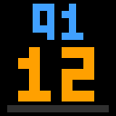
  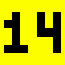
</p>
<p align="center"><sub>All previews in this README are rendered by the app's own code at the panel's real 32x32 resolution and enlarged 4x. See <a href="#regenerating-the-previews">Regenerating the previews</a>.</sub></p>

## Contents

- [Features](#features)
- [What you need](#what-you-need)
- [Quick start](#quick-start)
- [Using the app](#using-the-app)
- [Multiviewer integration](#multiviewer-integration)
- [Effects gallery](#effects-gallery)
- [Spotify integration](#spotify-integration)
- [Idle screens and night dimming](#idle-screens-and-night-dimming)
- [Panels and Bluetooth](#panels-and-bluetooth)
- [Settings reference](#settings-reference)
- [How it works](#how-it-works)
- [Panel protocol notes](#panel-protocol-notes)
- [Updates](#updates)
- [Building installers](#building-installers)
- [Regenerating the previews](#regenerating-the-previews)
- [Troubleshooting](#troubleshooting)
- [Limitations and platform status](#limitations-and-platform-status)
- [Acknowledgements](#acknowledgements)
- [License](#license)

## Features

**Formula 1 (through Multiviewer)**

- Track status on the panel in real time: green, yellow, red, Safety Car, VSC, and the chequered flag.
- Yellow flags show **which sector** is flagged, either as a number cut out of the yellow or as a small **track map** with the flagged stretch lit. Double yellows flash faster.
- "Safety Car in this lap" and "VSC ending" reuse the SC and VSC artwork with a pulsing green border.
- Short overlays for events: pit exit closed, rain starting, and a new overall fastest lap.
- A **countdown** before practice and qualifying sessions, including delayed starts and the gaps between qualifying segments.
- A **grid walkthrough** before a race (two drivers at a time, front to back), then a **winner** celebration, the **podium**, and **pole position** after qualifying, all in team colors.
- Handles scrubbing, pausing and re-syncing a Multiviewer replay, and loading a different session or circuit.

**Spotify**

- Shows the album art of the track that is currently playing.
- Steps aside automatically while a live Multiviewer session is running, and returns when it ends.

**Panels and the app**

- Several panels at the same time, each with its own size, brightness, orientation and clock style.
- Direct Bluetooth Low Energy from the main process. Known panels reconnect on their own.
- A startup animation when a panel connects.
- **Studio**: send your own images and GIFs, build an animation from stills, send raw commands, and **test every effect on demand** without waiting for a real event.
- System tray with live status, desktop notifications, an activity log, dark and light themes, and a first-run setup guide.

## What you need

- An iPixel-compatible LED matrix panel. These are sold under several names; the ones this project targets advertise a Bluetooth name starting with `LED_BLE_` or `iPixel`.
- A computer with a Bluetooth Low Energy adapter.
- [Node.js](https://nodejs.org/) 18 or newer, only to run from source or to build installers.
- For the F1 integration: [Multiviewer](https://multiviewer.app/) running on the same computer, with a live or replayed session open.
- For the Spotify integration: a free [Spotify developer app](https://developer.spotify.com/dashboard) (the app walks you through it, and this README has the steps too).
- An internet connection for the track map layout and for Spotify.

## Quick start

**Installers.** Download the latest installer for your system from the [Releases page](https://github.com/dekiller82/MVLP-2.0/releases/latest): a Windows setup `.exe`, a macOS `.dmg` (Intel or Apple silicon) or a Linux AppImage or `.deb`. The builds are not code-signed, so Windows SmartScreen shows a warning (More info, Run anyway) and macOS needs a right click, Open the first time.

**From source.**

```bash
git clone https://github.com/dekiller82/MVLP-2.0.git
cd MVLP-2.0
npm install
npm start
```

`npm install` also generates the app and tray icons (they are drawn by a script and are not checked in). Use `npm run dev` instead of `npm start` to forward the renderer console to your terminal.

1. **Close any phone app** that is connected to the panel. A panel accepts one Bluetooth connection at a time.
2. Open the **Devices** tab and click **Add Device**. MVLP scans for nearby panels; pick yours from the list.
3. Enter the panel resolution when asked (32x32 by default).
4. On the **Dashboard**, switch on **Multiviewer** and/or **Spotify**.

Next time you start MVLP, panels you have connected before reconnect automatically.

## Using the app

### Dashboard

The dashboard shows the state of both integrations, the flag or status currently being shown, the connected panels, and a few quick actions (send the clock to every panel, erase every buffer).

<p align="center">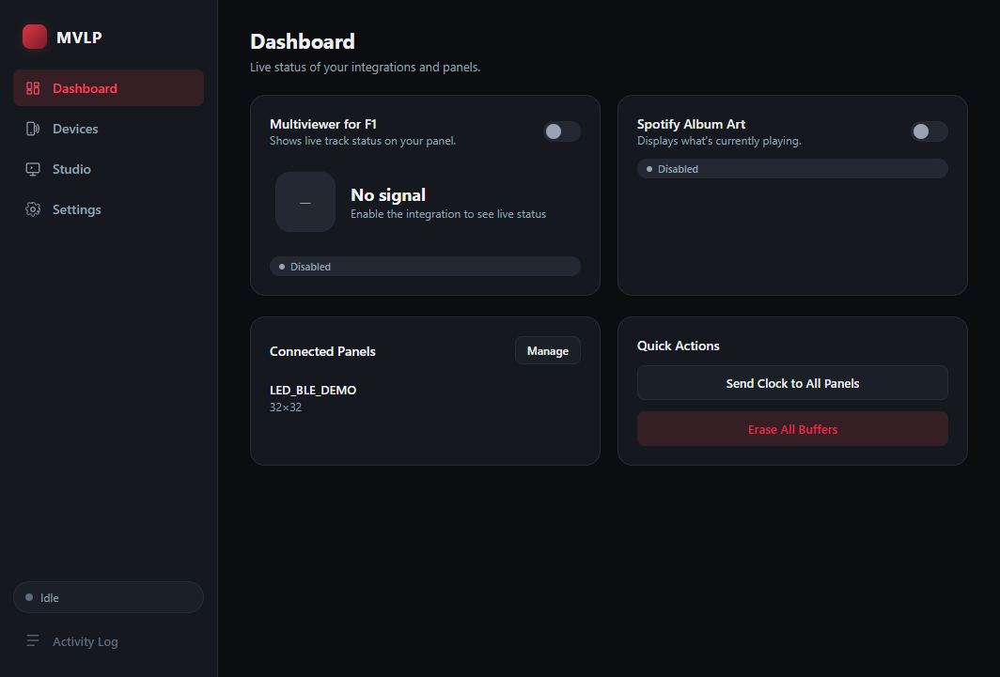</p>

### Devices

Each panel gets a card with its connection state and its settings:

| Setting | What it does |
| --- | --- |
| Width, Height | The panel resolution in pixels. Everything is drawn at this size. |
| Start buffer (1-255) | The storage slot on the panel that MVLP writes to. |
| Anchor (hex) | How an image is placed if it is smaller or larger than the panel (see [Panel protocol notes](#panel-protocol-notes)). |
| Exit clock style (1-8) | The clock the panel shows when neither integration has anything to display. |
| Auto-resize | Scale images to the panel size before sending. |
| Brightness (1-100) | Applied immediately. |
| Flip display 180 degrees | For panels mounted upside down. Applied immediately. |

You can also disconnect, reconnect, erase all buffers, or remove a panel (which forgets its settings).

<p align="center">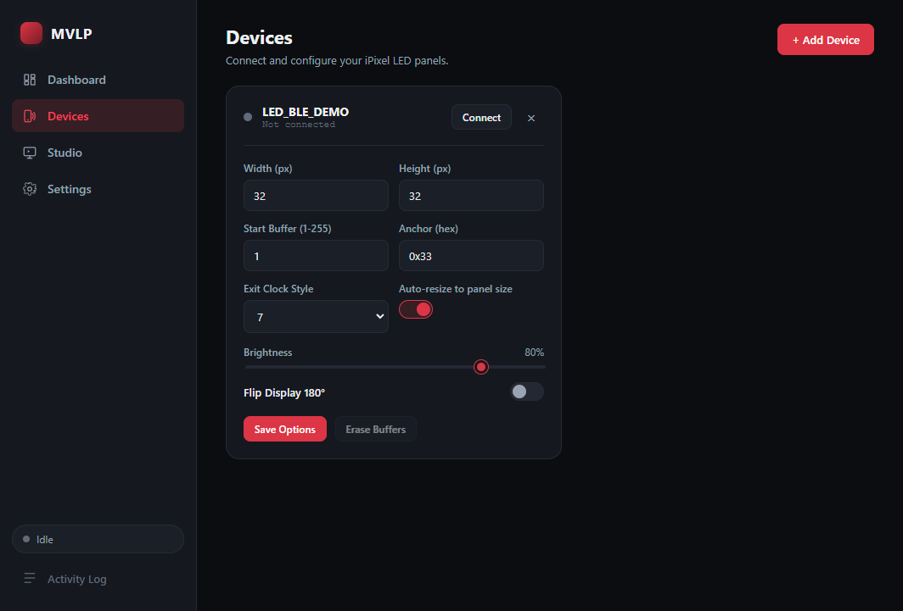</p>

### Studio

- **Quick Send**: one click sends any bundled animation (flags, rain, pit graphics, the Multiviewer logo and more) to every connected panel.
- **Test Effects**: shows an effect the way a real event would, then puts the real display back. See [Testing effects](#testing-effects).
- **Custom Send**: pick image or GIF files, optionally join several images into one, or turn a set of stills into an animation with a frame duration. Send to all panels or one.
- **Expert command**: send a raw hex payload straight to a panel.
- **Danger zone**: erase every buffer on every panel.

<p align="center">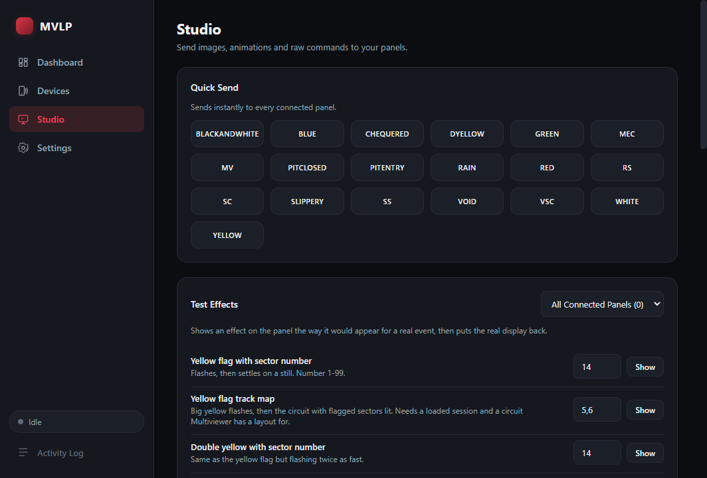</p>

### Settings

Theme, launch at login, minimize to tray, the startup animation, desktop notifications, the yellow flag options, and Spotify credentials. The full list is in the [Settings reference](#settings-reference).

<p align="center">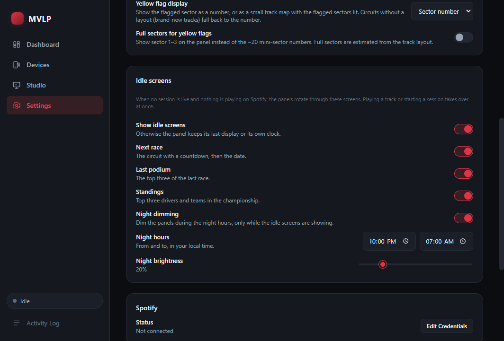</p>

<p align="center"><sub>The screenshots were taken with a placeholder panel that is not connected. Yours will show its own name and status.</sub></p>

### Tray and notifications

The tray icon changes colour with the Multiviewer status and its menu lets you toggle either integration without opening the window. Desktop notifications tell you when a panel connects, disconnects or fails, and when Spotify has a problem. The window's log drawer shows the same activity as text.

## Multiviewer integration

MVLP reads Multiviewer's local GraphQL API (`http://127.0.0.1:10101/api/graphql`). Open a session in Multiviewer, live or a replay, and switch the integration on. Nothing has to be configured in Multiviewer itself.

### Track status

| Track status | Panel |
| --- | --- |
| Green | Green flag |
| Yellow | Yellow flag, with the flagged sector when known |
| Safety Car | SC |
| Virtual Safety Car | VSC |
| Red | Red flag |
| VSC ending | VSC with a pulsing green border |
| "Safety car in this lap" message | SC with a pulsing green border |
| Chequered flag | Chequered flag |

Flags are read from both the track status and the Race Control messages, because sector information only exists in the messages.

### Yellow flags

A yellow can be shown two ways, chosen in **Settings, Yellow flag display**.

<table>
  <tr>
    <td align="center"><br><sub><b>Sector number</b><br>The number is cut out of the yellow in off pixels. It flashes, then settles on a still.</sub></td>
    <td align="center"><br><sub><b>Track map</b><br>Three full-screen flashes like the big yellow flag, then the circuit with the flagged stretch lit, which keeps flashing.</sub></td>
  </tr>
</table>

- **Which sector.** Race Control reports *marshal sectors*, about 20 to 25 per lap, not the three timing sectors. The number shown is that marshal sector number.
- **Full sectors.** Turn on **Full sectors for yellow flags** to show 1, 2 or 3 instead, or to light a whole timing sector on the map. No feed maps one numbering to the other, so MVLP estimates it from the circuit layout and the timing sector sizes. It is accurate to about one marshal sector near a boundary.
- **Double yellow** flashes faster (180 ms per phase instead of 250 ms), in both styles.
- **Several sectors** flagged at once: the number style shows the most recent one; the map lights all of them. When one clears, the display follows.
- **Track map data.** The circuit outline comes from Multiviewer's public v1 circuit API and is fetched once per circuit. Multiviewer has said that API is no longer maintained (it is kept up only for compatibility) and that no v2 API will be made public, so circuits added to the calendar from now on, such as the new Madrid circuit for 2026, will not appear in it. For a circuit with no layout, MVLP falls back to the number style. The layout is requested once when a session is read (again if you switch session), never while you stay on one. A failed request is retried with growing delays (15 seconds, then a minute, then every 5 minutes, with a little random spread), and if the server asks for a longer pause with a `Retry-After` header, that is honored. A circuit the API does not have (a 404) is not retried.

<table>
  <tr>
    <td align="center"><br><sub><b>Double yellow, number</b></sub></td>
    <td align="center"><br><sub><b>Double yellow, map</b></sub></td>
  </tr>
</table>

### Overlays and events

| Event | Panel | For how long |
| --- | --- | --- |
| Pit exit closed | Pit closed graphic | 10 seconds, then back to the track status |
| Rain starts (rainfall goes from 0 to above 0) | Rain animation | 10 seconds |
| New overall fastest lap | Solid purple | 2 seconds |
| Safety car in this lap | SC with a green border | Until the track status changes |
| VSC ending | VSC with a green border | Until the track status changes |
| Chequered flag | Chequered flag | Until the session (or qualifying segment) restarts |

Notes on the details:

- A new track status always cuts an overlay short.
- Rain is only announced when it starts. If it is already raining when you connect, nothing is shown.
- The fastest lap is checked about once a second by watching the best lap time across all drivers. The very first timed lap of a session is not announced.
- Events that were already in the message history when you connected are treated as state, not replayed as events.
- The chequered flag counts only while it is the latest thing to have happened. Qualifying and practice show one at the end of every segment, and the message stays in the log, so it clears again when the next segment starts.

### Session countdown

For **practice and qualifying** only, the panel counts down to the start of the session.

<p align="center"></p>

The label on top is the session ("Q1", "P2", "SQ1" for sprint qualifying). The big number is the minutes left (seconds in amber for the final minute, hours when it is far away). The bar along the bottom fills as the start approaches. A delayed start shows an hourglass. The states below, left to right: minutes, minutes, seconds in amber, hours away, delayed.

<p align="center">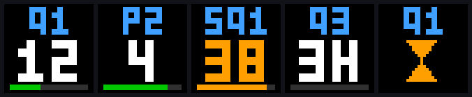</p>

- **Where the start time comes from.** The latest Race Control message such as `Q2 WILL START AT 16:29` (track-local time) wins; otherwise the scheduled start is used. A message saying the start "will be delayed" with no time shows the hourglass until a new time is announced.
- **Between qualifying segments** the countdown appears as soon as the next start is announced.
- **Idle screens.** When no session is live and nothing is playing, the panel rotates through the **next race** (circuit and countdown), the **last podium** and the **championship standings**, and dims at night.
- **Flags wait.** Flags and overlays that arrive during a countdown are remembered but not shown, and the right one appears the moment the session starts.
- **Accurate over Bluetooth.** Sending an image takes about a second or two, so the app works out where the countdown will be by the time the panel receives it. The last minute is sent as a single one-second-per-frame animation that runs by itself; before that the panel holds a still frame that is replaced once a minute, timed to land on the minute change.
- **Replay friendly.** The feed clock is combined with the Multiviewer player position, so it keeps up with normal playback, and the countdown is rebuilt if you scrub, pause or resume.
- **Races** are not covered: a race only starts when the lights go out, so there is no reliable time to count to.

### Driver screens: grid, winner, podium and pole

These four screens draw drivers in their **team colors**, using the number and three-letter code that Multiviewer reports for each driver.

<p align="center">
  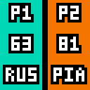
  
  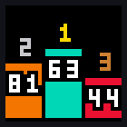
  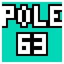
</p>
<p align="center"><sub>Grid walkthrough, race winner, podium, pole position</sub></p>

**Grid walkthrough (races).** From 45 minutes before the scheduled start until the lights go out, the panel walks the grid from the front, two drivers at a time: P1 and P2, then P3 and P4, and so on, scrolling down the grid from one pair to the next and looping. Each card shows the position, the driver number and their code on the team color. All text is white with a black outline, so it stays readable on every team color. Numbers are drawn at the same size as the position and the code, so a card does not feel crowded, and they are centered exactly on the card, both across and between the position and the code. A full lap of a 22 car grid takes about half a minute. Flags and overlays that arrive during the walkthrough are remembered but not shown, and the right flag appears the moment the race starts. The order is the running order in Multiviewer's timing data; if it does not match the grid on your session, please open an issue.

<p align="center">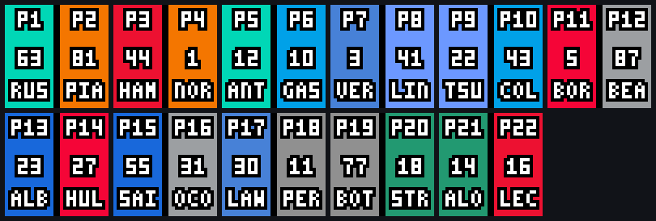</p>

**The end of a race plays out in order**, however early the result is known. In a replay the top three are already there the moment the flag falls, so the screens are paced instead of jumping straight to the result:

1. **Chequered flag.** It stays up for 5 seconds.
2. **Winner (races).** The winner's number appears big on their team color with confetti, for at least 10 seconds. The winner is the leader when they take the flag: Multiviewer marks every timing line with whether that car has taken the chequered flag.
3. **Podium (races).** Once the **top three have all taken the flag**, the winner screen gives way to the podium: three blocks in the team colors of the top three, the winner tallest in the middle, with gold, silver and bronze places. If they finished during the 10 seconds, the podium follows straight after; if not, the winner screen simply stays up until they have. The podium stays up until the next session.

If you connect after the finish, there is nothing to build up to and you go straight to the podium. If a session's timing data does not carry the per-car chequered flag, the podium is shown 5 seconds after the flag instead.

**Pole position (qualifying).** Shown only after the end of **Q3** (or the last segment of sprint qualifying), never after Q1 or Q2. The session status changes to finished the instant the chequered flag falls, while cars on their final flying laps are still to cross the line, so pole waits until every car that is still on a timed lap has taken the flag (cars in the pits, on out-laps, knocked out, stopped or retired are not waited for, and a 100 second cap covers anything the data cannot place). It shows "POLE" and the driver's three-letter code on their team color, and stays up until the next session.

### Sessions, scrubbing and replays

- Loading a different session or circuit is detected, and everything learned about the old one (flags, seen messages, chequered state, circuit layout) is dropped.
- State is rebuilt from the current message list on every poll, so scrubbing backwards does not leave stale flags behind.
- Newer display decisions win. Preparing an image can take a while, so each decision carries a sequence number and a slower, older send is dropped instead of overwriting a newer display.

## Effects gallery

Everything below is drawn by the app at the panel resolution. Several are also available as buttons under **Studio, Test Effects**.

<table>
  <tr>
    <td align="center"><br><sub><b>Safety car in this lap</b><br>SC with a pulsing green border</sub></td>
    <td align="center"><br><sub><b>VSC ending</b><br>VSC with a pulsing green border</sub></td>
    <td align="center">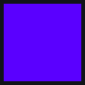<br><sub><b>Fastest lap</b><br>Solid purple for 2 seconds</sub></td>
    <td align="center"><br><sub><b>Startup</b><br>A scan line reveals the logo</sub></td>
  </tr>
</table>

**Sector numbers.** Every number from 1 to 24, as the still the yellow flag settles on:

<p align="center">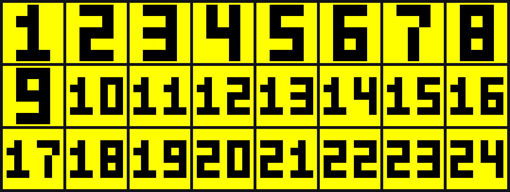</p>

**Track maps.** Miami with sectors 4 and 5 flagged, Miami with sector 12, and Baku with sectors 8 and 9, and 15 to 17. The flagged line flashes on the panel; this shows the lit frame:

<p align="center">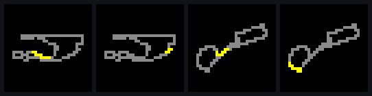</p>

**Design notes for a 32x32 panel**

- The border effects are two pixels deep: a bright outer ring and a dimmer inner ring, the same look as the bundled yellow flag.
- The purple for a fastest lap is deliberately blue-heavy. On an LED panel the red channel dominates, so a textbook purple reads as magenta.
- The track line is one pixel wide and the flagged stretch replaces those exact pixels, so it cannot bleed onto other parts of the circuit that run close by.
- Generated images are sent at exactly the panel size and are not resized again. Resizing to the same size still shifts and blurs pixel art.

### Testing effects

**Studio, Test Effects** shows an effect on demand and then restores the real display. It is the quickest way to check how something looks on your panel without waiting for a real event. Buttons:

yellow flag with a sector number, double yellow with a sector number, yellow flag track map, double yellow track map, safety car in this lap, VSC ending, fastest lap, rain, pit exit closed, chequered flag, session countdown (with a seconds box), start delayed, the grid walkthrough, race winner, podium, pole position, the three idle screens, and the startup animation. The four driver screens use the drivers of whatever session is loaded in Multiviewer.

A target picker sends to all panels or to one. If a real event arrives while a test is showing, the real event wins. The track map buttons need a session loaded in Multiviewer, because the layout comes from there.

## Spotify integration

1. Go to the [Spotify developer dashboard](https://developer.spotify.com/dashboard) and create an app.
2. Add this exact redirect URI to the app: `http://127.0.0.1:8888/callback`
3. In MVLP, switch on Spotify on the Dashboard (or open **Settings, Edit Credentials**) and enter the app's **Client ID** and **Client Secret**.
4. A browser tab opens to authorize the app. It only asks for permission to read what is currently playing.

Details:

- MVLP polls the now-playing endpoint every 3 seconds and, when the track changes, downloads the album cover and sends it as a small animation sized for the panel.
- The tokens are refreshed automatically. The client secret is stored encrypted with your operating system's secure storage (Electron `safeStorage`).
- If a panel connects after the first track was already fetched, the art is sent to it right away instead of waiting for the next song.
- **While a live Multiviewer session is running, Spotify pauses.** Flags take over the panel. When the session ends, or you switch Multiviewer off, MVLP re-sends the current track within a few seconds.
- Art stays up while music plays. If nothing has been playing for a minute, or a track has been paused for 30 seconds, the [idle screens](#idle-screens-and-night-dimming) take over; playing again brings the art straight back.
- If neither integration is switched on and the idle screens are off, the panel shows its clock.

## Idle screens and night dimming

When Multiviewer has no live session and Spotify is not playing, the panel rotates through up to three screens, ten seconds each. Any session or track takes over at once.

<p align="center">
  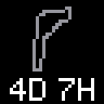
  
  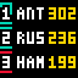
</p>
<p align="center"><sub>Next race, last podium, standings</sub></p>

- **Next race.** The circuit outline with the time to go ("4D 7H", "5H 30M", "45M", "NOW"), then the country code and the date. A race counts as still on for three hours after its start. A circuit without an outline in the bundled set gets a single page of code, countdown and date.
- **Last podium.** "LAST" and the country code, then the podium of the last race in team colors.
- **Standings.** The top three drivers with their points, then the top three teams.
- **Data.** It comes from the free [Jolpica F1 API](https://github.com/jolpica/jolpica-f1) (the community successor to Ergast), not from Multiviewer. Results and standings are refreshed at most every 6 hours and the calendar every 12, so a running app makes a handful of requests a day, one at a time. Everything is cached on disk, so the screens work offline after the first fetch, and failures back off (15 seconds, 1 minute, then every 5 minutes) while the old copy keeps being used. Only the public F1 data is requested; nothing about you is sent.
- **Outlines.** The circuit outlines are a snapshot from the MIT licensed [bacinger/f1-circuits](https://github.com/bacinger/f1-circuits) dataset, matched to the calendar by location (see [THIRD_PARTY_NOTICES.md](THIRD_PARTY_NOTICES.md)). `npm run circuits` rebuilds `assets/circuits.json` when a new circuit is added.
- **No data yet.** Offline on the very first run there is nothing to show, so the panel's own clock is used until data arrives.
- **Night dimming.** Between the night start and end times (default 22:00 to 07:00, your local time) the panels drop to the night brightness (default 20 percent, never above the panel's own brightness). It applies only while the idle screens are showing, so a live session or album art is never dimmed, and the normal brightness comes back the moment something else takes over or the night ends.

Every screen, the night window and the brightness are set under **Settings, Idle screens**. The Studio has a test button for each screen.

## Panels and Bluetooth

Bluetooth is handled entirely in the main process with [`@stoprocent/noble`](https://github.com/stoprocent/noble), a maintained fork of the Node BLE library with prebuilt binaries for Windows, macOS and Linux. There is no browser permission model and no device chooser dance; the app owns the connection.

- **Scanning.** The Add Device dialog scans for advertised names starting with `LED_BLE_` or `iPixel`.
- **Identity.** A panel is identified by its advertised name, which is derived from its hardware address and is stable. Its settings are stored under that name.
- **Auto-reconnect.** Every saved panel is reconnected on launch, and again every 15 seconds if the link drops. Disconnecting a panel yourself stops the retries for it.
- **On connect.** The startup animation plays, every buffer on the panel is erased, and then the right display for the moment appears: the current flag, the countdown, Spotify art, or the logo.
- **Writes.** Payloads are split into 244-byte chunks and each chunk is written *with response*, one at a time per panel. See the notes below for why.
- **Several panels.** Every panel is a separate connection with its own queue and its own resolution. Generated images are built per panel.

## Settings reference

| Setting | Default | Where | Description |
| --- | --- | --- | --- |
| Theme | Dark | Settings | Dark or light. |
| Launch at login | Off | Settings | Start MVLP when you sign in (Windows and macOS). |
| Minimize to tray on close | On | Settings | Closing the window keeps the app running in the tray. |
| Startup animation | On | Settings | Play the scan-line animation when a panel connects. |
| Desktop notifications | On | Settings | Notify on connects, disconnects and errors. |
| Yellow flag display | Sector number | Settings | Show a flagged sector as a number or as a track map. |
| Full sectors for yellow flags | Off | Settings | Show timing sectors 1 to 3 instead of marshal sectors. |
| Show idle screens | On | Settings | Rotate the idle screens when nothing is live or playing. |
| Next race, Last podium, Standings | On | Settings | Which idle screens are in the rotation. |
| Night dimming | On | Settings | Dim during the night hours, only while idle screens show. |
| Night hours | 22:00 to 07:00 | Settings | Local time window for dimming. |
| Night brightness | 20 | Settings | Brightness percent used during the night. |
| Multiviewer integration | Off | Dashboard, tray | Read Multiviewer and mirror the track status. |
| Spotify integration | Off | Dashboard, tray | Show album art. |
| Spotify credentials | none | Settings | Client ID and secret of your Spotify developer app. |

Settings are stored with `electron-store` in the operating system's per-user application data folder, in a file called `mvlp-config`.

## How it works

```
                 +------------------------------ Electron main process ------------------------------+
                 |                                                                                    |
 Multiviewer --> |  multiviewer.js   polls the GraphQL API, derives events and state                  |
   (10101)       |        |                                                                            |
 Spotify API --> |  spotify.js       polls now-playing, downloads album art                            |
                 |        v                                                                            |
                 |  controller.js    decides what every panel should show, builds images, arbitrates  |
                 |        |                                                                            |
                 |  protocol/*       encodes commands, PNG and GIF uploads, generates the effects      |
                 |        v                                                                            |
                 |  ble-bridge.js    scans, connects, reconnects, queues and writes (noble)            |
                 +--------|------------------------------------------------------------^-------------+
                          v                                                            |
                    LED panel(s)                                             IPC (preload, allow-listed)
                                                                                        |
                                                                              renderer: dashboard,
                                                                              devices, studio, settings
```

**Main process** (`src/main`)

| File | Role |
| --- | --- |
| `index.js` | App start, window, single-instance lock, wiring. |
| `ble-bridge.js` | Bluetooth: scan, connect by name, auto-reconnect, per-panel write queue with timeouts. |
| `controller.js` | The brain: turns feed events into displays, runs the countdown, overlays, test effects, startup animation and Spotify handover. |
| `multiviewer.js` | Polls Multiviewer and turns raw state into events: track status, sector flags, overlays, chequered, pre-session, session changes, circuit layout. |
| `idleData.js` | Jolpica calendar, results and standings for the idle screens: disk cache, TTLs, back-off, circuit outline matching. |
| `spotify.js` | OAuth (authorization code flow with a local callback), token refresh, now-playing polling. |
| `store.js` | Persistent settings and per-panel config; encrypts the Spotify secret. |
| `ipc.js`, `tray.js`, `autolaunch.js`, `logger.js` | IPC handlers, tray, login item, in-memory activity log. |
| `protocol/` | Panel commands, PNG and GIF upload framing with CRC32, image processing, and the generators for the sector numbers, track map, border effects, countdown, startup animation, the driver screens (grid walkthrough, winner, podium, pole) and the idle screens. |

**Renderer** (`src/renderer`) is plain HTML, CSS and JavaScript with no framework. It reaches the main process only through a small allow-listed bridge in `src/preload`.

**Design decisions worth knowing**

- **Events versus state.** The poller distinguishes history that was already there when it connected (state) from things that happen while watching (events). Anything that can be derived from the full message list, such as which sectors are yellow, is rebuilt on every poll rather than accumulated.
- **One decision at a time.** The controller keeps a display sequence number. Every decision increments it, and any image still being prepared for an older decision is dropped. This is what stops a slow countdown animation from overwriting a newer flag.
- **Time comes from the player.** Multiviewer's own feed clock only refreshes on play, pause and seek, so "now" is that reading plus how far the player has moved since.
- **Small, generated images.** Sector numbers, track maps, borders, countdowns and the startup animation are drawn procedurally at the panel's resolution, not shipped as files.

## Panel protocol notes

These panels speak a small reverse-engineered protocol over one GATT service. Most of it comes from the projects listed in the acknowledgements; a few points were learned the hard way while building this.

- **Service and characteristics.** Writes go to characteristic `0xFA02` under service `0x00FA`. Notifications come from `0xFA03`. (The service is the 16-bit `0x00FA`, not `0xFA00`; this is not documented anywhere obvious.)
- **Frames.** Every message is `[length u16 LE][command u16 LE][data]`, and the length **includes its own two bytes**. Getting this wrong makes the panel acknowledge the data and silently discard it.
- **Image upload.** Command `0x0002` uploads a PNG and `0x0003` a GIF. The data starts with `0x00`, the byte length (u32 LE), the CRC32 of the image (u32 LE), `0x00`, and the target buffer number, followed by the file itself.
- **Acknowledgement.** After an upload the panel sends `05 00 03 00 00` on `0xFA03`.
- **Write with response.** The characteristic accepts both write types. Write without response is faster but floods the panel, which drops the image without any error. Every write is sent with response.
- **Chunking.** 244 bytes per write is what the reference implementations use. A payload is a byte stream that the panel reassembles.
- **Colour reduction.** GIFs sent to the panel pass through a colour quantizer. It discards a colour that occurs in only one pixel (merging it into the nearest other colour), which is why the track map has no single-pixel markers.
- **Buffers.** Each panel has numbered storage slots. MVLP writes to the configured start buffer and replaces it in place.

Commands implemented in `src/main/protocol/commands.js`:

| Command | Code | Purpose |
| --- | --- | --- |
| Erase | `0x0102` | Clear one, several or all buffers |
| Brightness | `0x8004` | 1 to 100 |
| Upside down | `0x8006` | Flip the display 180 degrees |
| Clock mode | `0x8001` + `0x0106` | Set the time, then the clock style (1 to 8), date and 12/24 hour |
| Set pixel | `0x0105` | One pixel in a colour |
| Power | `0x0107` | On or off |
| DIY mode | `0x0104` | On or off |
| Default mode | `0x8003` | Return to the panel's own mode |
| Screen | `0x8007` | Select screen 1 to 9 |
| Program mode | `0x8008` | Play a list of buffers |
| Expert | any | Raw hex payload |

## Updates

MVLP looks at this repository's latest GitHub release at launch and every 6 hours (switch it off under **Settings, About**; **Check now** checks on demand). When a newer version exists a banner appears in the sidebar and in Settings.

- **Windows (installer) and Linux (AppImage):** the button says **Update now**. It downloads the update in the background with a progress percentage, then **Restart and install** replaces the app and starts the new version.
- **macOS and the Linux `.deb`:** the button says **Download from GitHub** and opens the release page. macOS cannot replace an app that is not code-signed, and a `.deb` belongs to the package manager.
- Only the version number and release page are requested from GitHub; nothing about you is sent. Running from source never checks.

## Building installers

Releases are built by GitHub Actions: pushing a tag like `v2.0.1` builds the Windows, macOS and Linux installers and attaches them to a new release, together with the small metadata files the in-app updater reads. Bump `version` in `package.json` to match the tag first. To build locally:

```bash
npm run dist:win     # NSIS installer
npm run dist:mac     # .dmg and .zip (build on macOS)
npm run dist:linux   # AppImage and .deb
npm run dist:all     # everything the host can build
```

Each script regenerates the icons first, then runs `electron-builder` (without publishing). On Windows, building needs either an administrator shell or Developer Mode switched on, because electron-builder unpacks a tool archive that contains symbolic links. Installers are written to `release/`. The native Bluetooth module is unpacked from the archive automatically (`asarUnpack` in `package.json`). Building macOS targets generally needs macOS.

## Regenerating the previews

The images under `docs/previews/` are produced by the same code that drives the panel:

```bash
npm run previews
```

The script renders each effect at 32x32, enlarges it 4x with nearest-neighbour scaling, and writes GIFs and PNGs. It needs the network only for the track map outlines.

## Troubleshooting

**The app exits immediately or nothing appears when I start it.**
Another MVLP is already running. Only one instance is allowed, and a second launch quits silently. Look in the system tray.

**`Cannot read properties of undefined (reading 'setAppUserModelId')` when starting from a terminal.**
The environment variable `ELECTRON_RUN_AS_NODE` is set in that shell, which makes Electron behave like plain Node. Unset it (`unset ELECTRON_RUN_AS_NODE` in bash, `Remove-Item Env:ELECTRON_RUN_AS_NODE` in PowerShell) and start again.

**My panel is not in the list.**
Make sure it is powered on and that nothing else is connected to it, especially the phone app. Only names starting with `LED_BLE_` or `iPixel` are listed. Check that Bluetooth is on.

**The first connection attempt fails with "unreachable" or "disconnected".**
This happens occasionally with these panels. MVLP retries on its own, and the second attempt normally succeeds.

**The panel connects but shows nothing.**
Check the panel resolution on its Devices card, and try **Studio, Quick Send** with a bundled animation. Sending an image with a wrong length header, or writing without response, makes a panel ignore the data; MVLP does neither.

**The yellow flag shows a number even though I chose Track map.**
The map needs the circuit layout. It is fetched from Multiviewer's v1 circuit API when a session is loaded, so you need an internet connection. Brand-new circuits (Madrid for 2026, for example) are not in it and never will be: Multiviewer has said that API is no longer updated. The activity log says which of these it is (`No track layout is available for ...` or `Could not load the track layout ...`). The Test Effects button explains the same thing in a message.

**The grid walkthrough, winner, podium or pole screen does not appear.**
The grid walkthrough only runs for a race that has not started, from 45 minutes before its scheduled start. The winner appears 5 seconds after the chequered flag once the leader has taken it, the podium once the top three all have (and the winner screen has had its 10 seconds), and pole only after Q3. All of them need Multiviewer's timing data for the session; the Test Effects buttons show each one on demand using the drivers of the loaded session.

**The panel is dark, or shows the clock, when nothing is on.**
The idle screens need data from the Jolpica API the first time; offline on a first run the clock is shown. If the panel is dim, check the night hours under Settings, Idle screens: dimming applies only while the idle screens show.

**The countdown, flags or map are wrong right after I load a different session.**
MVLP detects a session change by its session key and starts fresh. If it did not, please open an issue with the activity log lines around the switch.

**Spotify says the redirect URI is invalid.**
The redirect URI in your Spotify app must be exactly `http://127.0.0.1:8888/callback`, and nothing else on your computer may be using port 8888 while you authorize.

**Full sectors look off by one near a boundary.**
That is expected: the mapping from marshal sectors to timing sectors is an estimate. See [Yellow flags](#yellow-flags).

## Limitations and platform status

- Developed and tested on **Windows 10** with a **32x32** panel. The macOS and Linux builds are configured and the Bluetooth library supports them, but they have not been tested by the author. On Linux you need BlueZ and permission to use Bluetooth without root.
- The F1 features depend on what Multiviewer's local API exposes. If a future Multiviewer version changes it, parts may stop working.
- The track map needs a circuit that Multiviewer's public v1 circuit API knows. Multiviewer has said that API is no longer maintained and that there will be no public v2, so circuits new to the calendar will not get a layout, and the API could be removed at some point. Those circuits use the sector number instead. Layouts already seen are not cached on disk yet, so the map also needs an internet connection each time you start MVLP on a session.
- The countdown covers practice and qualifying, not races. Races get the grid walkthrough instead, because a race only starts when the lights go out and there is no reliable time to count to.
- There are no start lights: the feed does not report the five lights coming on, and the random delay before they go out cannot be predicted, so the panel simply reacts when the race starts.
- The podium and pole screens show the result as Multiviewer reports it at the finish. A penalty applied afterwards does not change what was already shown.
- In races Race Control does not announce the winner, so the winner screen relies on Multiviewer's per-car "taken the chequered flag" marker in the timing data.
- A panel shows one thing at a time. When several things could apply, the display logic picks one (see [Multiviewer integration](#multiviewer-integration)); there is no split screen.
- Whether a particular panel firmware plays every GIF timing exactly (very short frames, very long holds) is not guaranteed. The generated effects avoid extreme timings on purpose.

## Acknowledgements

- The original **[MVLP](https://github.com/dekiller82/MVLP)** Python app, which this project rewrites.
- **[sdolphin-JP/ipixel-ctrl](https://github.com/sdolphin-JP/ipixel-ctrl)** and **[lucagoc/pypixelcolor](https://github.com/lucagoc/pypixelcolor)** for the reverse-engineered iPixel protocol and the reference behaviour that made the Bluetooth side reliable.
- **[Multiviewer for F1](https://multiviewer.app/)** for the local API and the circuit dataset.
- **[Jolpica F1](https://github.com/jolpica/jolpica-f1)** for the free race calendar, results and standings API, and **[bacinger/f1-circuits](https://github.com/bacinger/f1-circuits)** for the circuit outlines (MIT, see [THIRD_PARTY_NOTICES.md](THIRD_PARTY_NOTICES.md)).
- **[@stoprocent/noble](https://github.com/stoprocent/noble)** for cross-platform Bluetooth Low Energy in Node.

MVLP is an unofficial fan project. It is not affiliated with or endorsed by Formula 1, Multiviewer, Spotify, or the makers of iPixel panels. Formula 1, F1 and related marks are trademarks of their respective owners.

## Related links

- [iPixel Color app (iOS)](https://apps.apple.com/jp/app/ipixel-color/id1562961996)
- [iPixel Color app (Android)](https://play.google.com/store/apps/details?id=com.wifiled.ipixels)

## License

[MIT](LICENSE)
